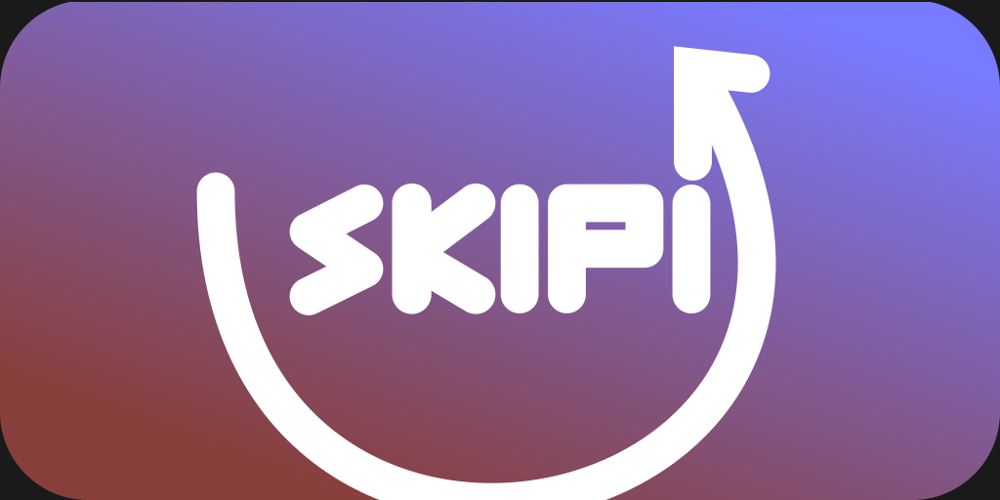
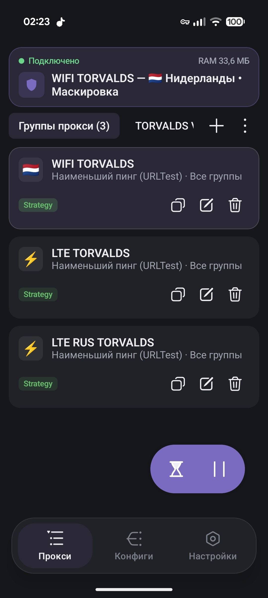
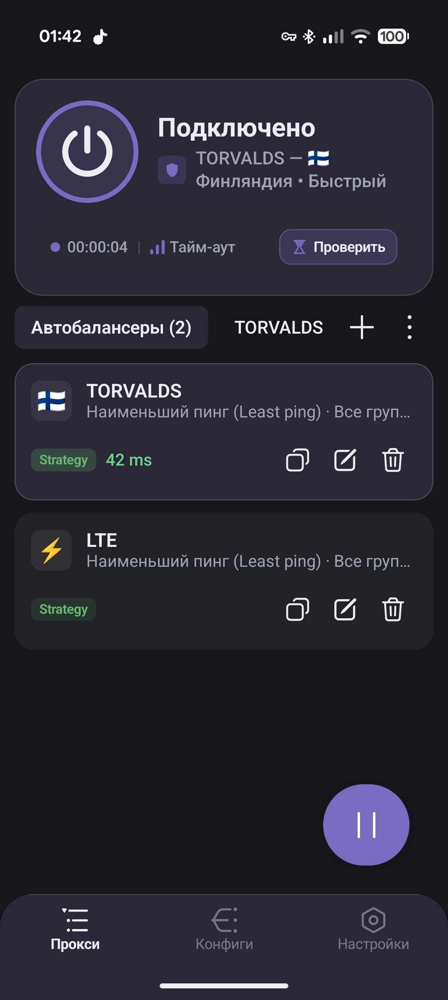
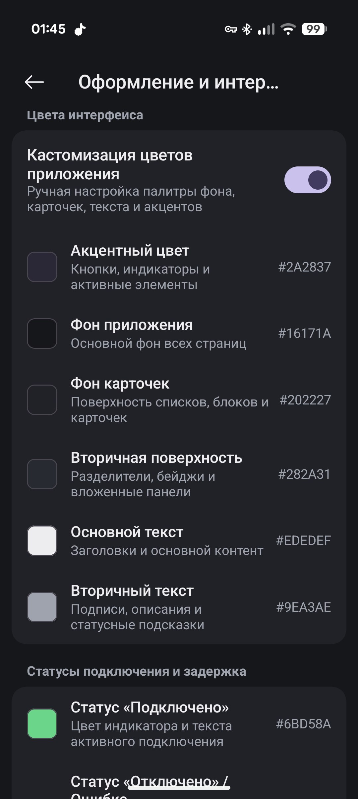
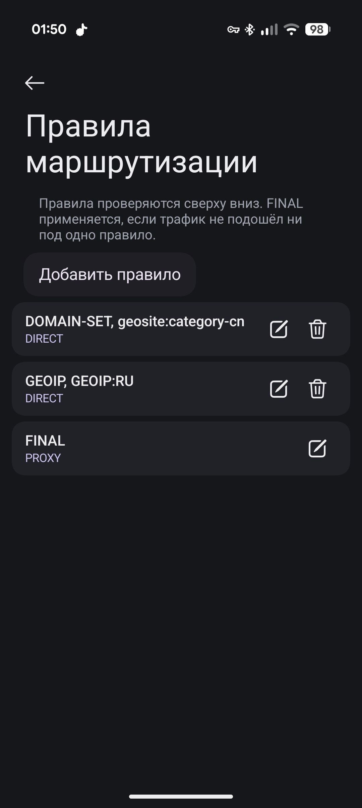
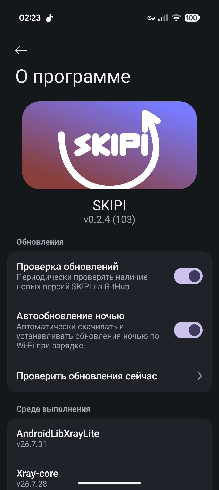

  

  <strong><a href="README.md">Русский</a> | <a href="README_EN.md">English</a> | <a href="README_ZH.md">简体中文</a> | <a href="README_FA.md">فارسی</a></strong>

  <strong>Beautiful, fast, and modern proxy client for Android</strong>

  
  
  
  
  

---

## 📢 Community & Telegram Channel

Join our official Telegram channel: **[@skipi_public](https://t.me/skipi_public)** ✈️

* 🚀 **Latest Releases & APKs:** get early access to test builds and newest features.
* 💬 **Community & Discussions:** ask questions, share configs, and get help.
* 📢 **News & Roadmap:** stay tuned with development progress and announcements.

  

---

## About The Project

**SKIPI** is a modern anti-censorship and network traffic management client for Android.

The core philosophy of the project is to deliver a powerhouse tool with extensive capabilities while preserving a smooth, clean, and pleasant user interface designed for comfortable daily use.

Under the hood, SKIPI integrates [Xray-core](https://github.com/XTLS/Xray-core), [SKIPI Core](https://github.com/ZloyRadetski/skipi-core), and [hev-socks5-tunnel](https://github.com/heiher/hev-socks5-tunnel). On the outside, it features a fully customizable UI built with Jetpack Compose, supporting dynamic Material You theming and deep visual personalization.

---

## Screenshots

  
  
  
  
  

---

## Features

* **All Essential Protocols:** VLESS (with XTLS Reality & Vision), VMess, Trojan, Shadowsocks (including SS-2022), Hysteria 2, WireGuard, and standard SOCKS5/HTTP proxies.
* **Smart Traffic Routing:** Full compatibility with Shadowrocket (`.conf`) rules and profiles. Flexible routing based on domains, GeoIP, GeoSite, and IP CIDR ranges, with intuitive drag-and-drop rule ordering.
* **Hassle-free Subscriptions:** Parses subscription formats from v2rayNG, Clash, Clash Meta (including age-key decryption), and Base64.
* **Automation & Scheduling:** Background updates for subscriptions and GeoIP/GeoSite databases via WorkManager, auto-switching based on active Wi-Fi networks.
* **Balancing & Chains:** Group servers for automatic lowest-latency selection (URL-Test), fallback routing, or multi-hop proxy chains.
* **Per-App Proxy:** Route only selected applications through the VPN tunnel.
* **Deep Customization:** Material You dynamic colors, custom accent palettes, and 9 vector launcher icon styles configurable in theme settings.
* **Proxy Sharing (Hotspot & LAN):** Built-in HTTP and SOCKS5 endpoints for sharing VPN connection with other devices over Wi-Fi.

---

## Supported Protocols

| Protocol | Transport & Security |
| :--- | :--- |
| **VLESS** | Reality, XTLS Vision, TLS, gRPC, WebSocket, TCP, HTTP/2, mKCP |
| **VMess** | TLS, WebSocket, gRPC, TCP, HTTP/2, mKCP |
| **Trojan** | TLS, gRPC, WebSocket, TCP |
| **Shadowsocks** | AEAD, SS-2022 (blake3) |
| **Hysteria 2** | UDP / QUIC |
| **WireGuard** | UDP |
| **SOCKS5 / HTTP** | TCP / Auth |
| **Custom JSON** | Arbitrary Xray configurations |

---

## License

This project is open-source and released under the [GPL-3.0 License](LICENSE).
